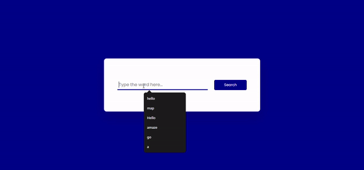

# Dictionary App

This project is a simple dictionary app that fetches word meanings using the DictionaryAPI and plays pronunciation audio. Users can type a word, search for its meaning, and hear its pronunciation.

## Features

- **Word Search**: Allows users to search for word meanings.
- **Pronunciation**: Plays the pronunciation of the word using an audio player.
- **Responsive Design**: Ensures compatibility across all device sizes.

## Technologies Used

- **HTML**: Structure of the project.
- **CSS**: Visual styling and layout.
- **JavaScript**: API calls, DOM manipulations, and audio playback.
- **DictionaryAPI**: Uses [DictionaryAPI](https://dictionaryapi.dev/) to fetch word definitions and pronunciations.

## Setup

1. Clone the repository:
   ```bash
   git clone https://github.com/username/dictionary-app.git
   ```
2. Navigate to the project folder:
   ```bash
   cd dictionary-app
   ```
3. Open the `index.html` file in your browser to run the project.

## Usage

- **Search for Words**: Type a word in the input box and click the "Search" button to get its meaning and pronunciation.
- **Play Pronunciation**: Click the speaker icon to listen to the pronunciation of the word.
- **Error Handling**: If the word is not found, a message will be displayed.

## Future Improvements

- Add support for more languages.
- Display additional word details like synonyms and antonyms.
- Implement user accounts for saving favorite words.

## Screenshot

### Demo

A demo of the Dictionary App:



---

This project was created for learning purposes by following content from the [@CodingArtist](https://www.youtube.com/@CodingArtist) YouTube channel. The tutorial can be found here: [Dictionary App Tutorial](https://www.youtube.com/watch?v=PUkgK7TI0x0).

**Note**: All word meanings and pronunciations are provided by [DictionaryAPI](https://dictionaryapi.dev/).
